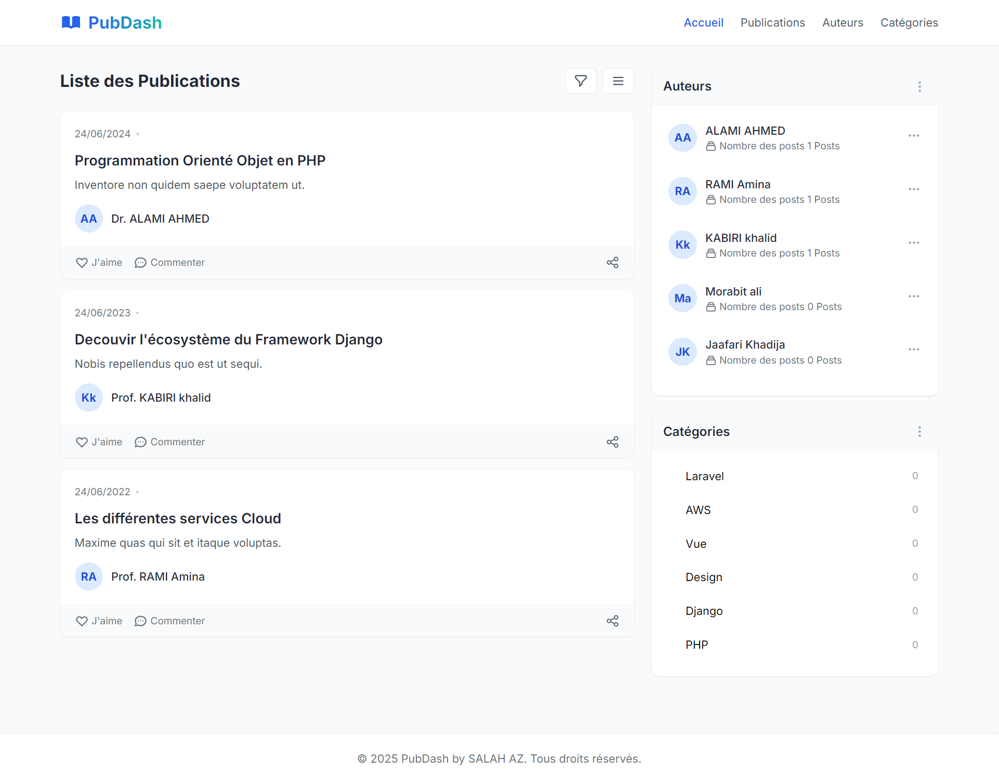

# PubDash

PubDash is a publication management system built with Laravel. It allows users to manage publications, authors, and categories efficiently. The project focuses on Laravel Components for reusable UI elements and maintains a clean, responsive design with Tailwind CSS.

## Features

-   List of publications with authors and categories
-   Author management
-   Category filtering
-   Responsive UI with Tailwind CSS

## Tech Stack

-   Laravel
-   Laravel Components
-   Tailwind CSS
-   MySQL

---

## Author

-   Salah Eddine Ait Zenni
-   GitHub: [salaheddineaz47](https://github.com/salaheddineaz47)
-   LinkedIn: [Salah Eddine Ait Zenni](https://www.linkedin.com/in/salaheddineaitzenni)
-   Email: [salaheddine.aitzenni@gmail.com](mailto:salaheddine.aitzenni@gmail.com)

---

**Feel free to reach out if you have any questions or suggestions!**
